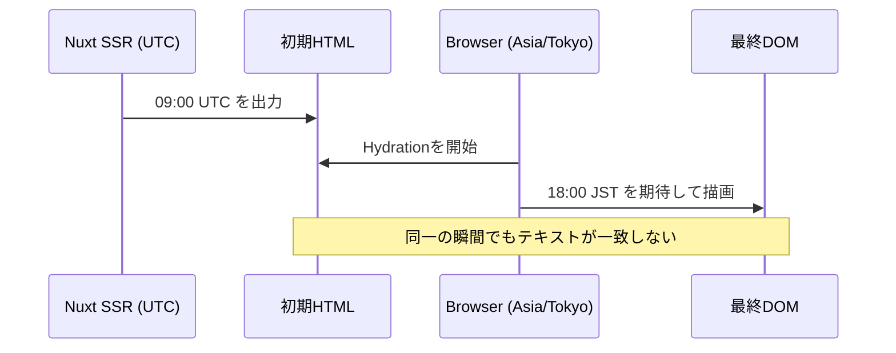

# Nuxtで「SSRではUTC、画面ではJST」になった：日時の表示差異を再現してHydrationを切り分ける

## はじめに

NuxtでSSRを使っている画面に日時を表示したところ、サーバーが返すHTMLでは`2026年8月1日 09:00 UTC`なのに、ブラウザで画面が完成すると`2026年8月1日 18:00 JST`へ変わる状態を意図的に再現しました。

この現象では、APIが違う値を返したように見えるかもしれません。しかし実際には、固定の`2026-08-01T09:00:00.000Z`をサーバーとブラウザが異なるタイムゾーンで整形していただけでした。

Nuxtの公式ドキュメントは、サーバーとクライアントの出力が一貫していないことをHydration mismatchの典型的な原因として挙げ、時間に基づく動的コンテンツはクライアント側で扱う選択肢を示しています。[1] 本記事では、小さな再現プロジェクトを使い、**症状を再現することから始めて、観測、仮説の除外、修正、再発防止テスト**までを追います。

## 先に結論

> **ブラウザにしかないタイムゾーン情報で初回HTMLの文字列を作らない。**
>
> SSRとHydrationの最初の描画は同じプレースホルダーにそろえ、利用者のタイムゾーンでの整形は`onMounted`後に行う。

NuxtではSSR時に`onMounted`は実行されず、ブラウザでアプリケーションをマウントした後に完全なVueライフサイクルが実行されます。[2] この違いを利用すると、SSRのHTMLとHydration開始時の値を一致させたまま、マウント後にブラウザ固有の表示へ更新できます。

| 状態 | SSRが返したHTML | Hydration後のブラウザ表示 | 判定 |
| --- | --- | --- | --- |
| バグあり | `2026年8月1日 09:00 UTC` | `2026年8月1日 18:00 JST` | 初回の文字列が不一致 |
| 修正後 | `ブラウザ時刻を取得中…` | ブラウザのタイムゾーンで整形した日時 | Hydrationの初期値が一致 |

## 作った再現プロジェクト

今回の演習はNuxt 4.5.2だけで構成しています。日時の整形処理を`shared/report-time.mjs`へ分け、`/buggy`に意図的な不一致、`/fixed`に修正版を置きました。

```text
nuxt-debug-screen-lab/
├── pages/
│   ├── buggy.vue        # SSRとClientで異なるタイムゾーンを使う
│   └── fixed.vue        # 初回値をそろえ、onMounted後に整形する
├── shared/
│   └── report-time.mjs  # 固定の瞬間を指定タイムゾーンで表示する
├── tests/
│   └── report-time.test.mjs
└── docs/
    └── debugging-record.md
```

再現する瞬間は意図的に固定しました。現在時刻を使うと、時刻の経過とタイムゾーンの差異が混ざり、何を比較しているのかが曖昧になるからです。

```js
export const REPORT_INSTANT = '2026-08-01T09:00:00.000Z'

export function formatReportTime(timeZone) {
  return new Intl.DateTimeFormat('ja-JP', {
    year: 'numeric',
    month: 'short',
    day: 'numeric',
    hour: '2-digit',
    minute: '2-digit',
    timeZone,
    timeZoneName: 'short',
  }).format(new Date(REPORT_INSTANT))
}
```

## バグありの実装

`/buggy`では、サーバー側だけUTC、クライアント側だけAsia/Tokyoを使うようにしました。

```vue
<script setup>
import { formatReportTime } from '~/shared/report-time.mjs'

const renderTimeZone = import.meta.server ? 'UTC' : 'Asia/Tokyo'
const formattedAt = formatReportTime(renderTimeZone)
</script>

<template>
  <p>{{ formattedAt }}</p>
</template>
```

このコードの重要な点は、同じ`REPORT_INSTANT`を使っていても、`formatReportTime`の返り値が環境で変わることです。Vueが比較するのは「同じ瞬間を表すか」ではなく、SSRが生成したDOMとクライアントが最初に期待するDOMが一致しているかです。NuxtのHydration処理では、SSR後にクライアントがコンポーネントとDOMノードを対応付け、イベントリスナーを付与します。そのため、サーバーとクライアントのデータを一貫させることが重要です。[2]

## 最初に立てた仮説

最終画面でJSTが見えたことだけでは、原因は決められません。次のように、確認すべき事実を分けました。

| 仮説 | 確認する観測点 | 今回の結果 |
| --- | --- | --- |
| APIが異なる日時を返した | 固定入力値、ネットワーク応答 | 固定値は常に`2026-08-01T09:00:00.000Z` |
| SSRがJSTで描画している | HTTPレスポンスのHTML | `09:00 UTC`を出力 |
| ブラウザが同じ文字列を期待している | 最終DOM、ブラウザのタイムゾーン | `18:00 JST`を表示 |
| Consoleの警告だけが問題である | 開発者ツールのConsole | 今回の観測では空。HTMLとDOMの比較を優先 |

ここでは、「Hydration mismatchなら必ずConsoleに警告が出るはず」と決めつけないことにしました。Nuxtは開発中のConsole警告を検出手段として紹介していますが、調査の根拠は警告の有無だけに置かず、サーバーHTMLと最終DOMを実測する方が堅実です。[1]

## 観測1：SSRが返したHTMLはUTCだった

まず、ブラウザを介さずにNuxtサーバーのHTMLを取得します。

```bash
curl -fsS http://127.0.0.1:3000/buggy \
  | grep -o '2026年8月1日[^<]*' \
  | head -5
```

実行結果は次のとおりでした。

```text
2026年8月1日 09:00 UTC
2026年8月1日 09:00 UTC
2026年8月1日 18:00 JST
```

最初の行は障害ダッシュボードのSSR出力、2行目は比較用のSSR観測窓、3行目はページ内に説明用として置いた「クライアントが期待する値」です。この結果から、少なくともサーバーはUTCの文字列を返していると分かります。

## 観測2：ブラウザの最終DOMはJSTだった

同じ`/buggy`をブラウザで開くと、ダッシュボードの日時は`2026年8月1日 18:00 JST`になりました。つまり、SSR HTMLの`09:00 UTC`はHydration後に`18:00 JST`へ差し替わっています。

この時点で「API応答が途中で変わった」という仮説は外せます。入力は同じで、表示用の文字列化だけが変わっていました。



## 原因：値ではなく、表示を環境依存にしていた

原因は`Date`の値ではありません。`Intl.DateTimeFormat`に渡す`timeZone`が、SSRとブラウザで異なっていました。

| レイヤー | `timeZone` | 表示文字列 |
| --- | --- | --- |
| Nuxt SSR | `UTC` | `2026年8月1日 09:00 UTC` |
| Browser | `Asia/Tokyo` | `2026年8月1日 18:00 JST` |

実務では、ここまで分かりやすい条件分岐を書かなくても起きます。たとえば、Node.js実行環境のタイムゾーンと利用者のOS設定が違うまま`Intl.DateTimeFormat()`を使う、`new Date()`で現在時刻を表示する、`localStorage`や`window.innerWidth`で初期表示を切り替える、といった実装です。Nuxtは時間依存コンテンツ、ブラウザ専用API、クライアント状態に基づく条件分岐を代表的な原因として挙げています。[1]

## 修正：初回Hydrationの値をそろえ、マウント後に更新する

今回の要件は「利用者の環境に合わせた日時を最終的に表示する」ことでした。そこで、SSRとHydrationの初回は同じプレースホルダーを返し、ブラウザ固有のタイムゾーン取得は`onMounted`へ移しました。

```vue
<script setup>
import { formatReportTime } from '~/shared/report-time.mjs'

const formattedAt = ref('ブラウザ時刻を取得中…')

onMounted(() => {
  const timeZone = Intl.DateTimeFormat().resolvedOptions().timeZone
  formattedAt.value = formatReportTime(timeZone)
})
</script>

<template>
  <p>{{ formattedAt }}</p>
</template>
```

SSR中は`onMounted`が実行されないため、サーバーHTMLは`ブラウザ時刻を取得中…`になります。クライアントもHydration時には同じ初期値を使うので、比較対象のテキストが一致します。マウント後にだけ、ブラウザのタイムゾーンを使った表示へ更新します。[2]

修正後のSSR HTMLは次のコマンドで確認できます。

```bash
curl -fsS http://127.0.0.1:3000/fixed \
  | grep -o 'ブラウザ時刻を取得中…\|2026年8月1日[^<]*' \
  | head -8
```

今回の結果では、初期表示に該当する4箇所がすべて`ブラウザ時刻を取得中…`でした。ブラウザで見ると、その後に実行環境のタイムゾーンを使った日時へ更新されます。

## `onMounted`、`useState`、`ClientOnly`のどれを選ぶか

この問題を「クライアントでだけ描けばよい」で一律に解決すると、SEOや初期表示の要件を損なう場合があります。何をSSRで確定させるべきかを先に決めます。

| 要件 | 選択肢 | 判断理由 |
| --- | --- | --- |
| 利用者の端末固有の表示を後から出せればよい | `onMounted` + プレースホルダー | 今回の解決策。初期HTMLとHydration値を一致させられる。 |
| SSRで作ったランダム値やAPI結果を同じ値として再利用したい | `useState`、`useAsyncData`、`useFetch` | SSRで取得した状態をHydrationへ再利用しやすい。[1] [2] |
| コンポーネント全体がブラウザ専用で、SSR不要 | `<ClientOnly>` | 既定スロットはサーバービルドから除外され、フォールバックを指定できる。[3] |
| 時刻の表示自体をNuxtに任せたい | `NuxtTime` | Nuxt公式が時間依存コンテンツの選択肢として提示している。[1] |

`ClientOnly`は便利ですが、デフォルトスロットのコンテンツがサーバービルドから除外されるため、初期HTMLに何を残したいかを確認してから使う必要があります。[3] 今回は日時のラベルやレイアウト自体はSSRで返したかったため、要素全体を`ClientOnly`にせず、値だけをマウント後に更新しました。

## 再発防止テスト

テストでは、同一瞬間をUTCとAsia/Tokyoで整形すると文字列が異なること、タイムゾーンを同じにすると同じ文字列になることを固定します。

```js
test('同じ瞬間でもUTCとAsia/Tokyoの表示文字列は異なる', () => {
  const utc = formatReportTime('UTC')
  const tokyo = formatReportTime('Asia/Tokyo')

  assert.notEqual(utc, tokyo)
})

test('タイムゾーンを固定すればSSRとClientは同じ表示文字列を得られる', () => {
  assert.equal(formatReportTime('UTC'), formatReportTime('UTC'))
})
```

この単体テストだけでHydration全体を保証できるわけではありません。そのため、今回の演習では次の3層を分けて確認しました。

| 層 | 確認方法 | 守りたい事実 |
| --- | --- | --- |
| 整形関数 | `pnpm test` | 同じ瞬間でも表示文字列が変わる条件を理解する。 |
| SSR出力 | `curl /buggy`、`curl /fixed` | サーバーが実際に返すHTMLを確認する。 |
| ブラウザ | `/buggy`と`/fixed`を開く | Hydration後に利用者が見るDOMを確認する。 |

## 実行方法

```bash
pnpm install
pnpm dev
```

別のターミナルで、テスト、型検査、本番ビルドを実行します。

```bash
pnpm test
pnpm typecheck
pnpm build
```

ブラウザでは`/buggy`を先に開き、SSR観測窓とClient観測窓が異なることを確認します。その後、`/fixed`で初回値がそろい、マウント後に表示が更新されることを確認してください。

## まとめ

今回のポイントは、日時の値が正しいかだけで終わらせず、**どの環境が、どの文字列を、いつ描いたのか**を分けて観測したことです。

デバッグの順番は次のようになります。まず再現可能な固定入力を用意し、次にHTTPレスポンスからSSR HTMLを確認します。そのうえでブラウザの最終DOMを確認し、入力値と表示用の変換を分けます。最後に、初回Hydrationの値をそろえる修正を行い、SSR・ブラウザ・テストの3層で検証します。

「画面が一瞬変わる」「サーバーで見たHTMLと画面の文言が違う」ときは、まずAPIやCSSを疑う前に、SSRとクライアントが同じ初期値を描けているかを確認すると、原因を狭めやすくなります。

## References

[1] [Nuxt: Nuxt and hydration](https://nuxt.com/docs/3.x/guide/best-practices/hydration)

[2] [Nuxt: Nuxt Lifecycle](https://nuxt.com/docs/3.x/guide/concepts/nuxt-lifecycle)

[3] [Nuxt: `<ClientOnly>`](https://nuxt.com/docs/4.x/api/components/client-only)
